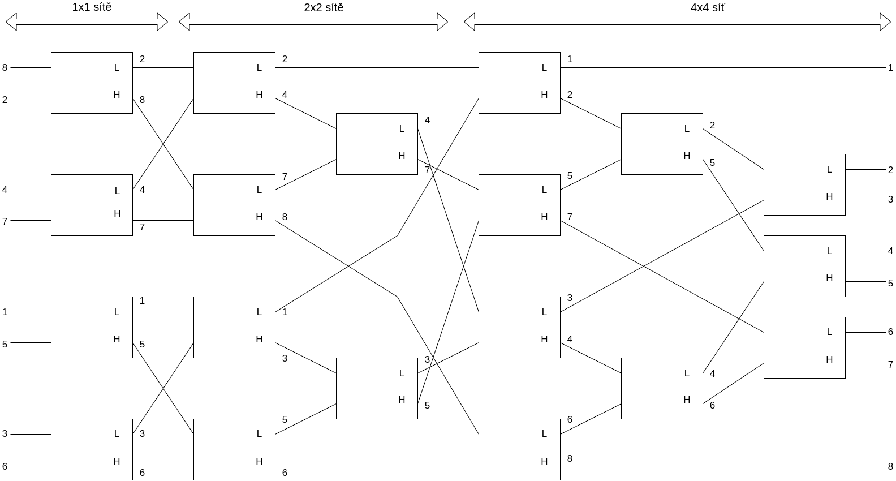

# Implementace algoritmu "Odd-Even Merge Sort"

Daniel Pátek, xpatek08  
VUT FIT 2022

## Analýza algoritmu

Algoritmus `Odd-Even Merge Sort` pracuje na principu sítě procesorů, které mají 2 vstupy a dokáží tedy porovnat 2 čísla. Tyto procesory postupně zpracovávají svůj vstup a seřazené čísla přeposílají ke zpracování dalším procesorům.
Musí platit, že počet čísel k seřazení je mocnina čísla 2 z důvodu dvouvstupových procesorů.

### Prostorová složitost

Výpočet na základě fází, které musí algoritmus vykonat, aby posloupnost čísel seřadil.
Například pro třetí fázi se jedná o `2^(M-3)` sítí 4x4 po 9 procesorech, kde `M` je mocnina čísla 2 počtu čísel k seřazení.

### Časová složitost

Časová složitost se vypočítá jako `t(N) = O(M^2) = O(log2N)`, kde `M` je mocnina čísla 2 počtu čísel k seřazení a `N` je počet čísel k sežazení.

### Cena algoritmu

Cena algoritmu se spočítá jako `c(N) = t(N) * p(N) = O(N*log^4N)`, kde `N` je počet čísel k sežazení, `t()` je šasová složitost a `p()` je prostorová složitost.  
(není optimální)

## Implementace

Pro účely tohoto projektu bylo třeba vytvořit síť procesorů tak, aby seřadila výslednou sekvenci 8 náhodně generovaných čísel.  
Výsledná síť se nachází na diagramu níže. Obsahuje čtyři 1x1 sítě, dvě 2x2 sítě a jednu 4x4 síť zapojené postupně za sebou. Pro tuto implementaci je potřeba 19 procesorů. Znázorněná síť obsahuje také ukázkové hodnoty vstupu a proces jejich seřazení.  

### Implementovaný program pracuje následovně

- inicializace knihovny MPI
- načtení vstupního souboru, import neseřaného pole čísel a rozeslání těchto čísel na vstupy prvních procesorů (pouze procesor 0)
- každý procesor postupně vyhodnotí svoje vstupy a výsledky rozešle do správných procesorů podle diagramu níže.
- poslední procesory odešlou seřazené hodnoty znovu procesoru 0 s příslušným tagem určujícím výsledné pořadí
- vypsání seřazené sekvence čísel (pouze procesor 0)

## Závěr

Implementace tohoto algoritmu byla úspěšná a výsledný program úspěšně seřadí posloupnost osmi čísel.
